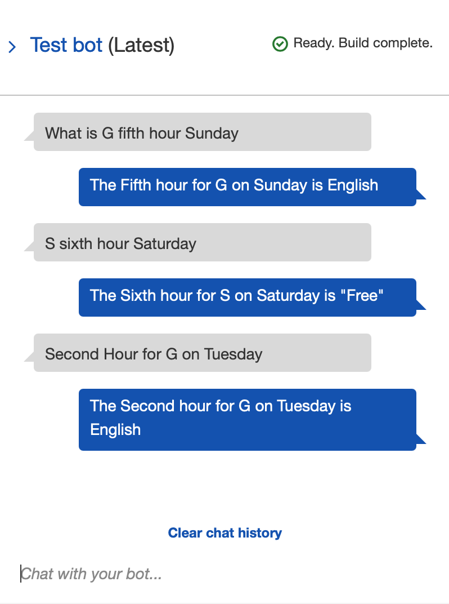

# Time Table Bot

Time Table Bot is a Chat Bot powered by [AWS Lex](https://aws.amazon.com/lex/), [AWS Lambda](https://aws.amazon.com/lambda/) and [AWS RDS](https://aws.amazon.com/rds/). When queried using Natural Language, the bot responds by stating the time slot for the staff.

## Installation

This script is for use in the AWS Lambda serverless compute service, and as such there is no local installation needed.

However the files in this repo need to be zipped and uploaded to Lex for this to work.

Using the package manager [pip](https://pip.pypa.io/en/stable/) install and copy the `pymysql` and `PyMySQL-1.0.2.dist-info` folders into the same directory as `chatbot.py`.

```bash
pip install -r requirements.txt
```

## Usage
This README assumes that the required Intents and Slots have already been setup in the AWS Lex interface.


### Populating the Database

Run the `populate.py` script either locally (if RDS is in a public network) or on the Lambda platform itself.
As this script will be run from within the AWS ecosystem the connection details are hard coded in the script.
This script generates random data to populate the `"timetables"` table. The other tables are always populated the same.

```shell
python populate.py
```

After the script is successfully completed the tables must be populated like so

### periods
| id | period   |
|----|----------|
| 1  | Language |
| 2  | English  |
| 3  | Maths    |
| 4  | Social   |
| 5  | Science  |

### days
| id | day       |
|----|-----------|
| 1  | Monday    |
| 2  | Tuesday   |
| 3  | Wednesday |
| 4  | Thursday  |
| 5  | Friday    |
| 6  | Saturday  |
| 7  | Sunday    |

### timings
| id | timing |
|----|--------|
| 1  | First  |
| 2  | Second |
| 3  | Third  |
| 4  | Fourth |
| 5  | Fifth  |
| 6  | Sixth  |

### staff
| id | staff_name |
|----|------------|
| 1  | S          |
| 2  | G          |

### timetable (partial table shown)
| day_id | timing_id | staff_id | period_id |
|--------|-----------|----------|-----------|
| 1      | 6         | 2        | 5         |
| 1      | 3         | 2        | 1         |
| 3      | 5         | 1        | 4         |
| 3      | 2         | 2        | 3         |
| 1      | 4         | 1        | 2         |
| 5      | 1         | 1        | 2         |
| 6      | 5         | 2        | 5         |
| 4      | 5         | 2        | 1         |
| 3      | 4         | 2        | 3         |



## License
[MIT](https://choosealicense.com/licenses/mit/)

